# Conjure architecture

Conjure is a self-building browser agent powered by a Redis state spine and Browserbase cloud-browser runtime. The diagram follows the product from left to right.

```mermaid
flowchart LR
    %% Conjure palette: tokens.css
    classDef human fill:#6C6AF5,stroke:#ADABFF,color:#FFFFFF,stroke-width:2px
    classDef primary fill:#222290,stroke:#6C6AF5,color:#FFFFFF,stroke-width:2px
    classDef service fill:#101026,stroke:#6C6AF5,color:#F0F0F5,stroke-width:1.5px
    classDef secondary fill:#16163A,stroke:#54546E,color:#F0F0F5,stroke-width:1px
    classDef core fill:#222290,stroke:#ADABFF,color:#FFFFFF,stroke-width:3px
    classDef voicecore fill:#6C6AF5,stroke:#F0F0F5,color:#FFFFFF,stroke-width:3px
    classDef external fill:#F0F0F5,stroke:#6C6AF5,color:#08080F,stroke-width:1.5px
    classDef observe fill:#ADABFF,stroke:#222290,color:#08080F,stroke-width:2px

    USER["USER<br/>describe what the browser should do"]:::human

    subgraph CHROME["CONJURE CHROME EXTENSION"]
        direction TB
        UI["CHAT + VOICE<br/>React · TypeScript · Vite"]:::primary
        CONTEXT["LIVE BROWSER CONTEXT<br/>tabs · DOM · console · cookies"]:::service
        UI <--> CONTEXT
    end

    subgraph BACKEND["PYTHON AGENT BACKEND"]
        direction TB
        API["FASTAPI<br/>REST + WebSocket streaming"]:::primary
        AGENT["LANGCHAIN AGENT<br/>plan · build · act · self-correct"]:::service
        MODS["MOD ENGINE<br/>generate · validate · ship JS/CSS"]:::service
        API --> AGENT --> MODS
    end

    subgraph HEART["CONJURE CORE"]
        direction TB
        REDIS[("REDIS<br/>persistent memory + conversations<br/>live job streams + sandbox cache")]:::core
        BB["BROWSERBASE<br/>cloud browser execution<br/>isolated testing + replay + logs"]:::core
        REDIS <-->|"state coordinates every run"| BB
    end

    subgraph VOICE_LAYER["CONVERSATIONAL VOICE LAYER"]
        direction TB
        DEEPGRAM["DEEPGRAM<br/>real-time voice interface"]:::voicecore
        STT["NOVA-2<br/>speech → intent"]:::service
        TTS["AURA<br/>response → natural speech"]:::service
        STT --> DEEPGRAM --> TTS
    end

    subgraph INTELLIGENCE["INTELLIGENCE + AUTOMATION"]
        direction TB
        MODELS["GROQ · CLAUDE · NEMOTRON<br/>reasoning + code generation"]:::external
        STAGEHAND["STAGEHAND SDK + PLAYWRIGHT<br/>navigate · act · extract · verify"]:::external
    end

    RESULT["TESTED BROWSER MODS<br/>applied instantly in Chrome"]:::human
    SENTRY["SENTRY<br/>errors + traces + healing signal"]:::observe

    USER --> UI
    CONTEXT <-->|"context + streamed progress"| API
    UI -->|"push-to-talk audio"| STT
    TTS -->|"spoken acknowledgement + result"| UI
    DEEPGRAM <-->|"voice requests through FastAPI"| API
    AGENT <-->|"memory + orchestration"| REDIS
    AGENT <-->|"tool-calling"| MODELS
    MODS -->|"builds to test"| BB
    STAGEHAND <-->|"controls sessions"| BB
    BB -->|"verified findings + replay"| MODS
    MODS --> RESULT
    RESULT -->|"active bundles"| CONTEXT
    CONTEXT -.-> SENTRY
    AGENT -.-> SENTRY
    BB -.-> SENTRY

    linkStyle default stroke:#6C6AF5,stroke-width:1.5px,color:#F0F0F5
    style CHROME fill:#08080F,stroke:#6C6AF5,stroke-width:2px,color:#F0F0F5
    style BACKEND fill:#08080F,stroke:#6C6AF5,stroke-width:2px,color:#F0F0F5
    style HEART fill:#101026,stroke:#ADABFF,stroke-width:3px,color:#F0F0F5
    style VOICE_LAYER fill:#101026,stroke:#6C6AF5,stroke-width:3px,color:#F0F0F5
    style INTELLIGENCE fill:#101026,stroke:#54546E,color:#F0F0F5
```

## Reading the system

- **Redis is the state spine:** it carries conversations, durable agent memory, active jobs, progress streams, and cached sandbox verdicts across the system.
- **Browserbase is the execution layer:** Conjure uses isolated cloud browsers for remote actions and for validating generated mods with logs, screenshots, and replayable sessions.
- **Python + FastAPI orchestrate the loop:** the LangChain agent combines browser context, model reasoning, mod-generation tools, Redis state, and Browserbase results.
- **Stagehand and Playwright drive Browserbase:** Stagehand supplies agentic navigation and extraction; Playwright supplies CDP access, cookie injection, DOM access, and scripted checks.
- **Deepgram powers a separate conversational layer:** Nova-2 turns push-to-talk audio into agent intent, while Aura speaks acknowledgements and completed results back to the user. FastAPI keeps the voice API key server-side.
- **Sentry supports the reliability loop:** it collects extension, backend, and sandbox signals.

The colors come directly from `conjure-extension/src/sidepanel/tokens.css`: ground `#08080F`, surface `#101026`, royal indigo `#222290`, accent violet `#6C6AF5`, accent lavender `#ADABFF`, and text `#F0F0F5`.
